# DataContract Lab

DataContract Lab is a data quality and schema-drift monitoring tool for analysts. Upload two versions of a dataset — a "baseline" and a "new" one — and it tells you exactly what changed between them: columns added, removed, or renamed; data types that shifted; missing values that crept in; and both categorical and numeric columns whose overall distribution shifted, each backed by an actual statistical test (chi-square and Kolmogorov–Smirnov respectively) instead of just a changed average or mode.

**In plain words:** imagine yesterday's export had columns `customer_id, age, city, purchase_amount`, and today's suddenly has `customer_id, age, location, purchase_amount, discount_code` — with `location` holding the exact same values `city` used to. DataContract Lab catches that `city` was silently renamed to `location`, flags the new `discount_code` column, and checks whether `purchase_amount`'s missingness or overall shape changed too — then rolls all of it into a single 0-100 quality score and a plain-English summary.

**Live app: [datacontractlab.streamlit.app](https://datacontractlab-zgnhknzmqryyt8spdyp3mj.streamlit.app/)** — no setup needed. Upload two CSVs (or use the files in [`sample_data/`](sample_data)) and run a comparison right in the browser.

[](https://datacontractlab-zgnhknzmqryyt8spdyp3mj.streamlit.app/)


[](https://github.com/snehaprasad11/DataContract_Lab/actions/workflows/ci.yml)

## Contents

- [Screenshots](#screenshots)
- [Why This Exists](#why-this-exists)
- [Features](#features)
- [Tech Stack](#tech-stack)
- [Architecture](#architecture)
- [Project Structure](#project-structure)
- [Local Setup](#local-setup)
- [User Manual](#user-manual)
- [Sample Data](#sample-data)
- [Testing](#testing)
- [Deployment](#deployment)
- [Known Limitations](#known-limitations)
- [Future Improvements](#future-improvements)

## Screenshots

All screenshots below are captured directly from the running app, not illustrations.

| Upload & preview | Column profiles |
| --- | --- |
| 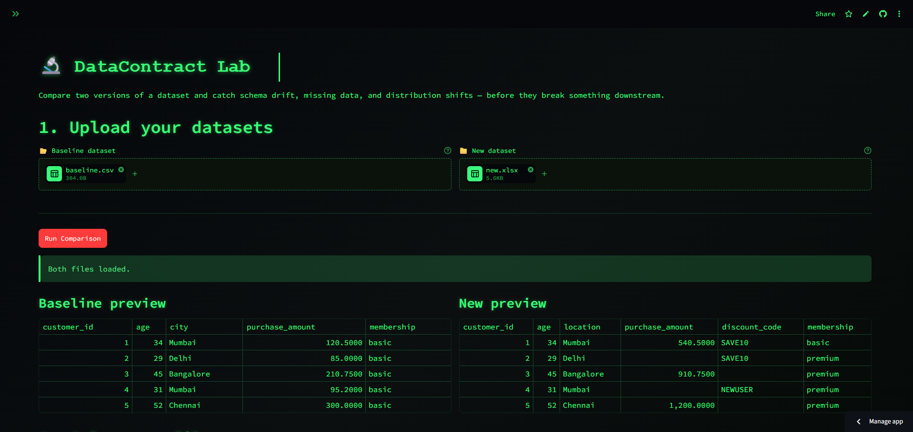 | 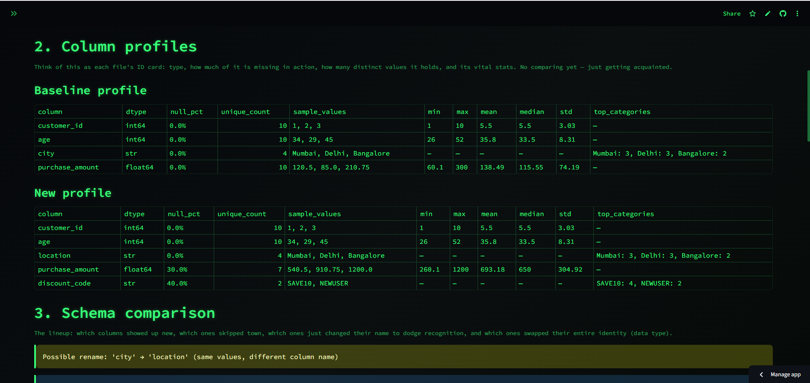 |

| Schema comparison & drift detection | Missing-value drift chart |
| --- | --- |
| 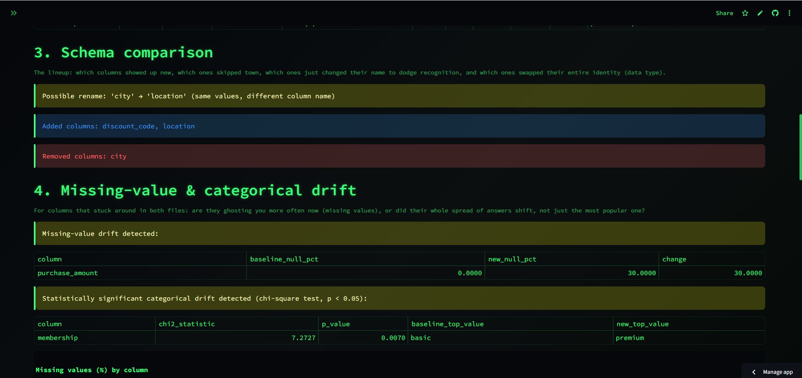 | 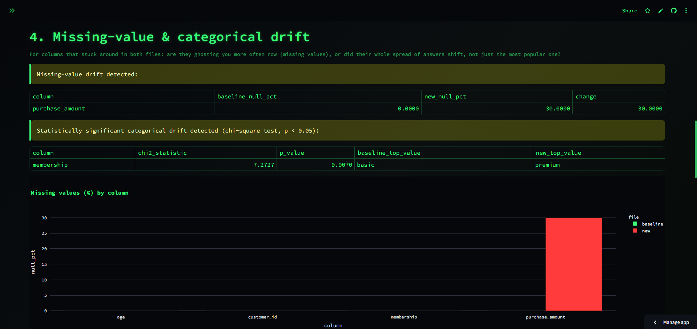 |

| Numeric distribution drift (KS test + overlay histogram) | Data quality score & summary |
| --- | --- |
| 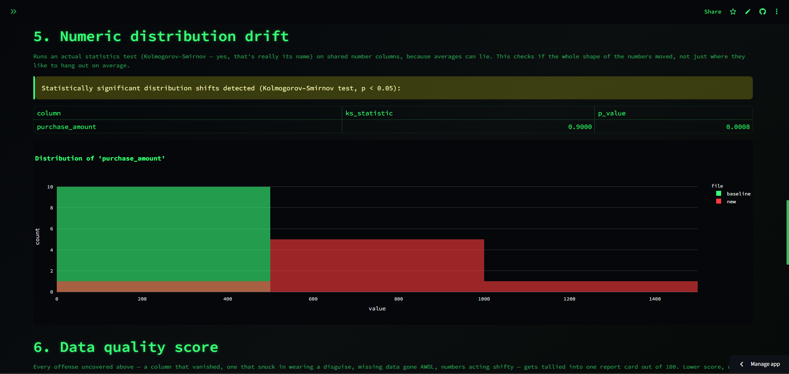 | 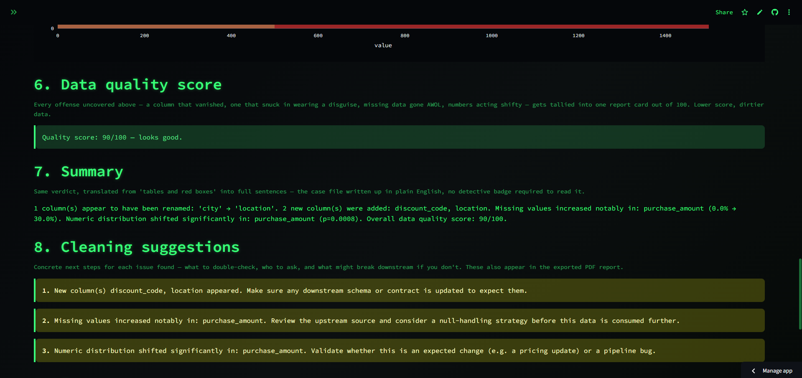 |

**Scan history** — every comparison saved to MySQL, pulled fresh from the database on every page load:

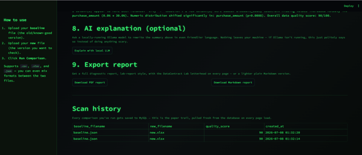

**The exported PDF report** — letterhead on every page, colored quality-score box, lab-panel-style diagnostic tables, and numbered suggestions:

| Page 1 — Overall assessment | Page 2 — Diagnostic panels | Page 3 — Suggestions |
| --- | --- | --- |
| 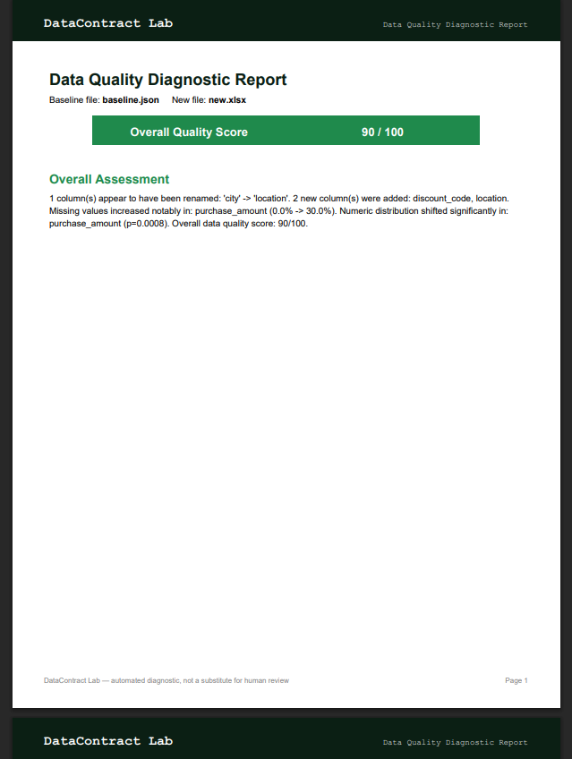 | 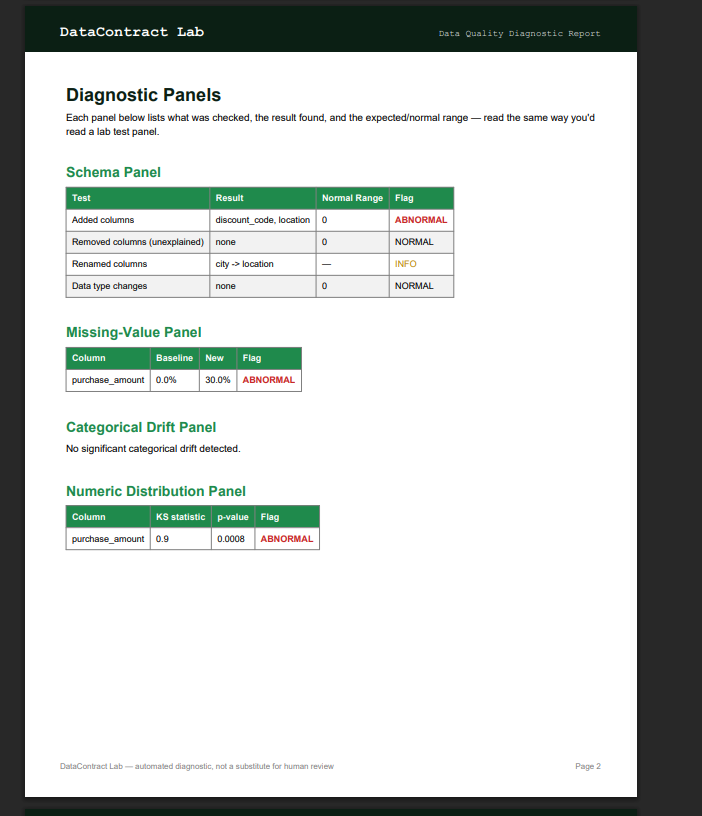 | 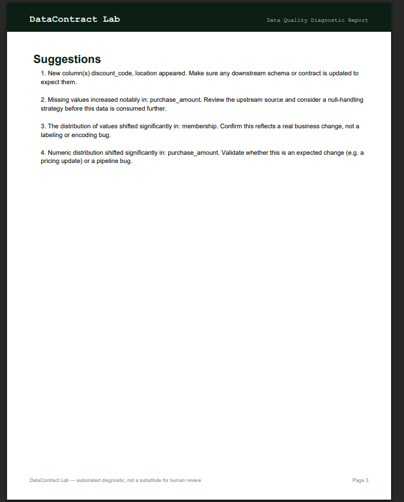 |

## Why This Exists

Datasets change silently all the time — a column gets renamed by an upstream team, a data pipeline starts dropping values, a business change shifts the numbers you're used to seeing. Most of the time nobody notices until a downstream report or model breaks. DataContract Lab is a fast, visual way to diff two versions of a dataset and catch that kind of drift before it causes a real problem.

## Features

- **Multi-format upload** — CSV, Excel (`.xlsx`), and JSON, and you can even mix formats between the baseline and new file
- **Column profiling** — type, % missing, unique values, and stats (min/max/mean/median/std or top categories) for every column in each file
- **Schema comparison** — added columns, removed columns, data type changes, and a heuristic that detects likely *renames* (a removed column and an added column that share the same actual values)
- **Missing-value drift** — flags columns where the % of missing values jumped significantly
- **Categorical drift** — a real chi-square test on the full category distribution of shared non-numeric columns, so it catches shifts even when the most common value stays the same
- **Numeric distribution drift** — a real Kolmogorov–Smirnov statistical test on shared numeric columns, not just a compared average, with an overlaid histogram to visualize the shift
- **0-100 data quality score** — a single number combining every issue found, weighted by severity
- **Plain-English summary** — a rules-based narrative paragraph synthesizing every finding
- **Cleaning suggestions** — concrete, per-issue remediation steps shown live in the app and in the exported PDF (e.g. "confirm this rename is intentional before downstream consumers break")
- **Optional local LLM explanation** — rewrites the summary in friendlier language via a locally-running Ollama model; fails gracefully with a clear message if Ollama isn't running, never crashes the app
- **Report export** — a full diagnostic **PDF** (letterhead on every page, colored quality-score box, lab-panel-style tables, numbered suggestions) or a lightweight **Markdown** file
- **Scan history** — every comparison is saved to MySQL and displayed in a "Scan History" table that persists across app restarts

## Tech Stack

| Layer | Tech |
| --- | --- |
| App / UI | Streamlit |
| Data processing | Pandas, NumPy |
| Statistics | scipy (chi-square test for categorical drift, Kolmogorov–Smirnov test for numeric drift) |
| Visualization | Plotly |
| Database | MySQL, via SQLAlchemy + PyMySQL |
| PDF generation | ReportLab |
| Optional local LLM | Ollama (`llama3.2`) |
| Config | python-dotenv |

## Architecture

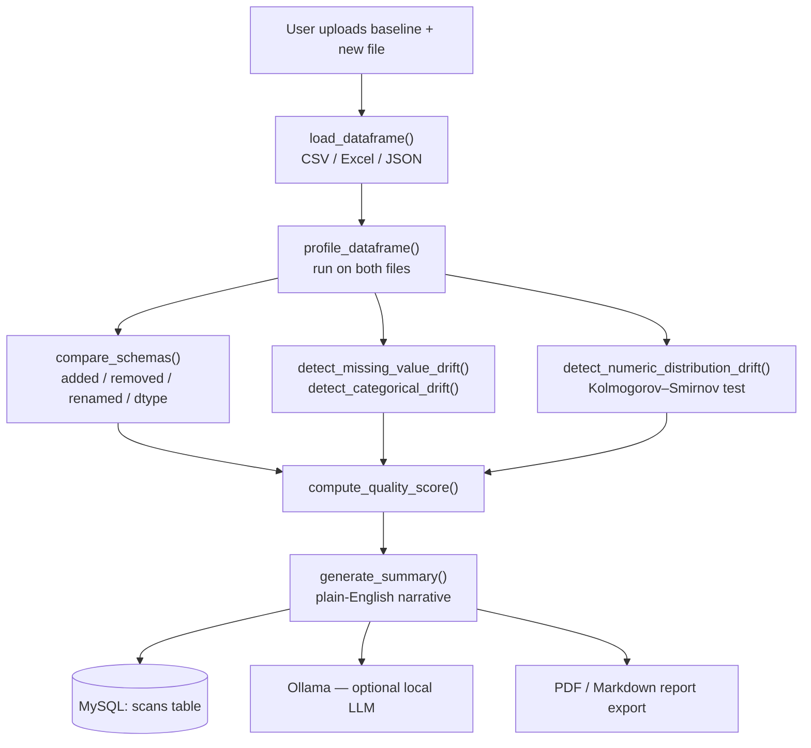

## Project Structure

```text
DataContract_Lab/
├── app.py                 # the entire app: UI, profiling, drift detection, PDF/DB logic
├── requirements.txt        # exact pinned dependency versions
├── schema.sql              # reference copy of the MySQL schema (app creates it automatically)
├── .streamlit/
│   └── config.toml         # dark hacker-terminal theme (base=dark, green accent, monospace font)
├── .env                    # your local MySQL credentials — not committed, see Local Setup
├── sample_data/
│   ├── baseline.csv / .xlsx / .json
│   └── new.csv / .xlsx / .json     # deliberately drifted versions for testing
└── venv/                   # local virtual environment — not committed
```

## Local Setup

There's a [live hosted version](https://datacontractlab-zgnhknzmqryyt8spdyp3mj.streamlit.app/) if you just want to try it. To run it yourself locally, you'll need Python and a local MySQL server — follow the steps below.

1. **Clone the repo and create a virtual environment:**
   ```
   git clone <your-repo-url>
   cd DataContract_Lab
   python -m venv venv
   ```
2. **Activate it** (Command Prompt: `venv\Scripts\activate` — PowerShell: `.\venv\Scripts\Activate.ps1`).
3. **Install dependencies:**
   ```
   pip install -r requirements.txt
   ```
4. **Set up MySQL.** Make sure a MySQL server is running locally, then create a `.env` file in the project root:
   ```
   DB_HOST=localhost
   DB_PORT=3306
   DB_USER=root
   DB_PASSWORD=your_mysql_password_here
   DB_NAME=datacontract_lab
   ```
   The app creates the database and the `scans` table automatically on first run — you don't need to run `schema.sql` by hand (it's kept only as documentation of what gets created).
5. **(Optional) Set up Ollama** if you want the "Explain with local LLM" button to work: install from [ollama.com/download](https://ollama.com/download), then `ollama pull llama3.2`. If you skip this, the app still works fully — that button just shows a message explaining Ollama isn't reachable instead of crashing.
6. **Run the app:**
   ```
   streamlit run app.py
   ```
   It opens automatically at `http://localhost:8501`.

## User Manual

1. Upload a **baseline** file (the older/known-good version) and a **new** file (the one you want to check) — any mix of `.csv`, `.xlsx`, `.json`.
2. Click **Run Comparison**.
3. Review the column profiles, schema comparison, missing-value/categorical drift, and numeric distribution drift sections — each has a plain-language caption explaining what it checks.
4. Check the **Data Quality Score** and the plain-English **Summary**.
5. Optionally click **Explain with local LLM** for a friendlier AI-generated rewrite of the summary.
6. Download a **PDF** or **Markdown** report, or scroll to **Scan History** to see every past comparison pulled from MySQL.

## Sample Data

`sample_data/` contains a baseline/new pair in all three supported formats, deliberately constructed with drift: `city` renamed to `location`, a new `discount_code` column, several `purchase_amount` values now missing, and the remaining amounts shifted roughly 4-5x higher — enough to trip every detector in the app for testing.

## Testing

The drift-detection logic lives in `drift_engine.py`, deliberately separated from the Streamlit UI so it can be unit-tested without spinning up the app or a database. `tests/test_drift_engine.py` covers all of it with `pytest`:

```bash
pytest -v
```

The suite (24 cases) exercises schema comparison (adds/removes, dtype changes, the rename heuristic), missing-value drift thresholds, categorical drift, numeric distribution drift, quality-score arithmetic (including the clamp-to-zero and rename-not-penalized edge cases), the summary text, and the cleaning suggestions. One test — `test_detect_categorical_drift_catches_shift_even_when_top_value_unchanged` — pins the exact behavior that motivated moving from a mode-only check to a chi-square test: a 60/40 → 90/10 shift where the most common value never changes but the distribution clearly did.

Every push and pull request runs the same suite in GitHub Actions (see the CI badge above and [`.github/workflows/ci.yml`](.github/workflows/ci.yml)), on a clean Python 3.12 environment installed from `requirements.txt`.

## Deployment

The live app runs on:

- **[Streamlit Community Cloud](https://streamlit.io/cloud)** (free tier) — deploys straight from this GitHub repo, no server to manage.
- **[TiDB Cloud Serverless](https://tidbcloud.com)** (free tier) for MySQL-compatible storage — it speaks the MySQL wire protocol, so the same `pymysql`/SQLAlchemy code runs unchanged versus local MySQL; the only difference is enabling TLS (`DB_SSL=true`), which TiDB Cloud requires on its public endpoint.

The same code runs locally and in the cloud with no branching — configuration is read by `get_setting()`, which checks Streamlit's `st.secrets` first (how the cloud provides config) and falls back to local environment variables from `.env`. To deploy your own copy, point Streamlit Community Cloud at a fork and set these keys in the app's **Secrets** box:

```toml
DB_HOST = "gateway01.<region>.prod.aws.tidbcloud.com"
DB_PORT = "4000"
DB_USER = "<prefix>.root"
DB_PASSWORD = "<your-password>"
DB_NAME = "datacontract_lab"
DB_SSL = "true"
ENABLE_OLLAMA = "false"
```

`ENABLE_OLLAMA=false` hides the local-LLM button on the hosted app, since a remote visitor's browser can't reach an Ollama running on your machine (see the note below).

## Known Limitations

- **Ollama explanation is local-only by nature** — it calls `http://localhost:11434` on whichever machine is running the app, so it only works when you run the app yourself locally; on the hosted deployment it is turned off via `ENABLE_OLLAMA=false`. Making it work for a remote visitor would require hosting an LLM (a paid API or a dedicated GPU server), which is out of scope for a free tool — so locally it also fails gracefully with a clear message when Ollama isn't reachable.
- **Free-tier cold starts** — the hosted app sleeps after a period of inactivity (Streamlit Community Cloud) and takes a few seconds to wake on the first visit; the TiDB Serverless free tier likewise has generous but finite storage/request quotas.

## Future Improvements

Realistic next steps, roughly in order of value:

- **Configurable thresholds in the UI** — the significance level (`alpha = 0.05`) and the missing-value drift threshold (`10` percentage points) are currently constants in `drift_engine.py`; exposing them as sidebar controls would let analysts tune sensitivity per dataset.
- **PSI (Population Stability Index)** alongside the chi-square / KS tests — PSI is a standard drift metric in analytics and ML monitoring, and reporting it would make the output more familiar to data teams.
- **Compare against a *stored* baseline** — today the scan history is a log of past *runs*; a natural extension is saving a full baseline dataset and re-running drift against it later, so drift is tracked over time for the same source.
- **Per-column severity view** — a single sortable table scoring each column's drift severity across all four checks, instead of the current per-section breakdown.
- **Data-contract export** — emit a machine-readable contract (JSON/YAML) describing the expected schema and distributions, so the "new" file can be validated against it automatically in a pipeline.
- **Scheduled / API-driven monitoring** — accept datasets via an endpoint and alert on drift, moving from an interactive tool toward an automated data-quality gate.

